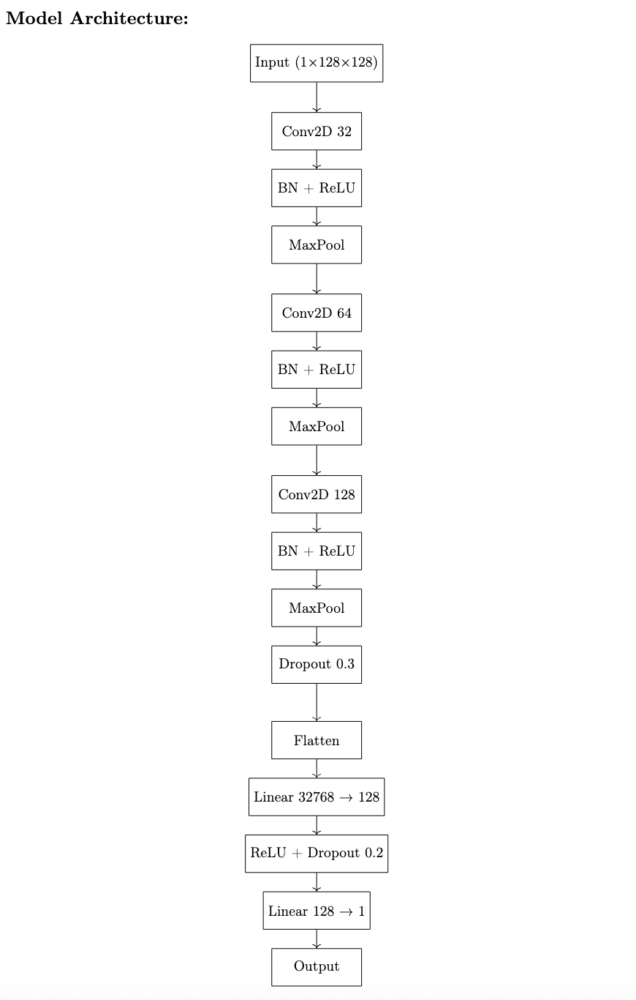

# predict-aligmnt-score-from-dot-plot
Predicting alignment score from dot plots.

This project provides a deep learning approach to predict sequence alignment scores directly from dot plot images of DNA sequence pairs. It leverages convolutional neural network (CNN) trained on synthetic datasets to estimate alignment quality, enabling rapid assessment without explicit sequence alignment computation.

# Model Architecture and Training Configuration

## Model Overview

The implemented model is a convolutional neural network (CNN) designed for regression on grayscale dot plot images of size `128 × 128`. The architecture contains three convolutional blocks followed by two fully connected layers.

---

## CNN Architecture Details

### Convolutional Layers

- **Conv Block 1**:
  - Conv2D: 32 filters, `3×3` kernel, padding = 1
  - Batch Normalization
  - ReLU activation
  - MaxPooling: `2×2`

- **Conv Block 2**:
  - Conv2D: 64 filters, `3×3` kernel, padding = 1
  - Batch Normalization
  - ReLU activation
  - MaxPooling: `2×2`

- **Conv Block 3**:
  - Conv2D: 128 filters, `3×3` kernel, padding = 1
  - Batch Normalization
  - ReLU activation
  - MaxPooling: `2×2`
  - Dropout: 0.3

### Fully Connected Layers

- Flatten layer
- Linear: `128 × 16 × 16 → 128`
- ReLU activation
- Dropout: 0.2
- Linear: `128 → 1` (regression output)

---

## Training Configuration

| Parameter            | Value                                   |
|----------------------|-----------------------------------------|
| Optimizer            | Adam                                    |
| Learning Rate        | 0.001 (`1e-3`)                          |
| Loss Function        | `0.7 * MSE + 0.3 * MAE`                 |
| Batch Size           | 32                                      |
| Epochs               | 40 (with early stopping)                |
| Early Stopping       | Patience = 7                            |
| Scheduler            | ReduceLROnPlateau (factor = 0.5, patience = 3) |
| Device               | GPU (if available), else CPU            |
| Random Seed          | 42 (for reproducibility)                |

---

## Hyperparameter Tuning Strategy

- **Loss Function**: A combination of MSE and MAE to balance smooth convergence and outlier robustness.
- **Dropout Rates**: Set to 0.3 in convolutional layers and 0.2 in fully connected layers to reduce overfitting.
- **Learning Rate**: Tested in the range `[1e-4, 1e-2]`, best performance with `1e-3`.
- **Number of Filters**: Progressively increased (32 → 64 → 128) to support hierarchical feature extraction.
- **Regularization**: Used both dropout and early stopping to prevent overfitting.
- **Scheduler**: ReduceLROnPlateau was employed to dynamically reduce learning rate on plateauing validation loss.

---

## Model Diagram

Here is a conceptual diagram of the model (simplified):




## Dot Plot Dataset Generation Summary

### Overview
A balanced dataset of dot plot images and corresponding alignment scores was generated using synthetic DNA sequence pairs. The dataset is split into training, validation, and test sets and includes image metadata in structured JSON format.

---

### Dataset Summary

| Attribute              | Value                         |
|------------------------|-------------------------------|
| Total samples          | 8000                          |
| Sequence length        | 128 base pairs                |
| Dot plot image size    | 126 × 126 pixels              |
| Alignment method       | Biopython `PairwiseAligner` (global alignment) |
| Dot plot method        | Matching 3-mers across sequences |
| Alignment score bins   | 40–50, 50–60, ..., 120–128    |
| Max samples per bin    | 1000                          |
| Mutation rates used    | [0.09, 0.2, 0.3, 0.45, 0.6, 0.75, 0.9] |
| Training samples       | ≈ 5360                        |
| Validation samples     | ≈ 1360                        |
| Test samples           | ≈ 1280                        |
| Metadata format        | JSON                          |
| Output directories     | `data_dotplots/plots`, `data_dotplots/metadata` |

---

### Sequence Generation and Mutation

- Base sequences of length 128 are randomly generated from the alphabet {A, C, G, T}.
- Mutated sequences are created by introducing substitutions, insertions, and deletions at predefined mutation rates.
- Each mutated sequence is trimmed or padded to maintain the original length of 128 base pairs.

---

### Alignment Score Computation

- Alignment scores are computed using the `Bio.Align.PairwiseAligner` in global mode with the following configuration:
  - Match score: 1
  - Mismatch score: -1
  - Gap open penalty: -0.5
  - Gap extension penalty: -0.1
- Scores are rounded to the nearest integer and categorized into 10-point bins.

---

### Dot Plot Generation

- A dot plot is computed by comparing all k-mers (`k=3`) of the two sequences.
- A pixel is set to 255 (white) in the dot plot image if the k-mers at corresponding positions match.
- The resulting matrix is saved as a grayscale image (`.png`) using PIL.

---

### Metadata

Each sample is associated with the following metadata:
```json
{
  "id": "00001",
  "seq1": "ACGT...",
  "seq2": "AGCT...",
  "score": 87,
  "mutation_rate": 0.45,
  "dotplot": "plots/dot_00001.png"
}


